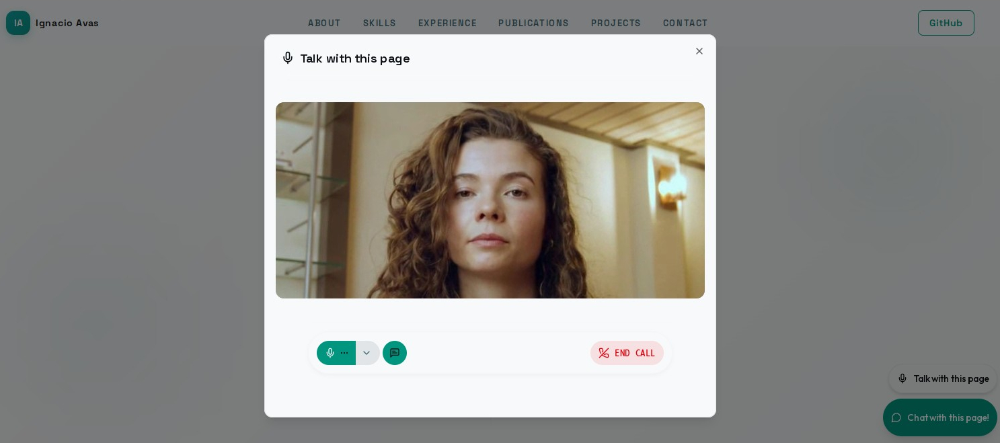

<a href="https://livekit.io/">
  
</a>

# LiveKit Agents - Ignacio's website

A complete project for building voice AI apps with [LiveKit Agents for Python](https://github.com/livekit/agents) and [LiveKit Cloud](https://cloud.livekit.io/).

The project includes:

- A simple voice AI assistant
- An avatar built on [Anam](https://docs.livekit.io/agents/models/avatar/plugins/anam/)
- A voice AI pipeline built on [LiveKit Inference](https://docs.livekit.io/agents/models/inference)
  with [models](https://docs.livekit.io/agents/models) from OpenAI, Cartesia, and Deepgram. More than 50 other model providers are supported, including [Realtime models](https://docs.livekit.io/agents/models/realtime)
- Eval suite based on the LiveKit Agents [testing & evaluation framework](https://docs.livekit.io/agents/start/testing/)
- [LiveKit Turn Detector](https://docs.livekit.io/agents/logic/turns/turn-detector/) for contextually-aware speaker detection, with multilingual support
- [Background voice cancellation](https://docs.livekit.io/transport/media/noise-cancellation/)
- Deep session insights from LiveKit [Agent Observability](https://docs.livekit.io/deploy/observability/)
- A Dockerfile for [production deployment to LiveKit Cloud](https://docs.livekit.io/deploy/agents/)


## Screenshot



## Run the agent

Before your first run, you must download certain models such as [Silero VAD](https://docs.livekit.io/agents/logic/turns/vad/) and the [LiveKit turn detector](https://docs.livekit.io/agents/logic/turns/turn-detector/):

```console
uv run python src/agent.py download-files
```

Next, run this command to speak to your agent directly in your terminal:

```console
uv run python src/agent.py console
```

To run the agent for use with a frontend or telephony, use the `dev` command:

```console
uv run python src/agent.py dev
```

In production, use the `start` command:

```console
uv run python src/agent.py start
```


The project is production-ready and includes a working `Dockerfile`. To deploy it to LiveKit Cloud or another environment, see the [deploying to production](https://docs.livekit.io/deploy/agents/) guide.

### Create the agent

To create the agent for the first time on LiveKit Cloud, run:

```console
lk agent create --secrets-file .env.prod --region eu-central
```

### Update the agent

To deploy a new version of the agent, run:

```console
lk agent deploy
```


## License

This project is licensed under the MIT License - see the [LICENSE](LICENSE) file for details.
